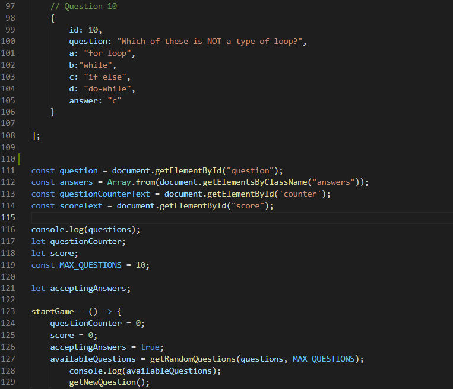
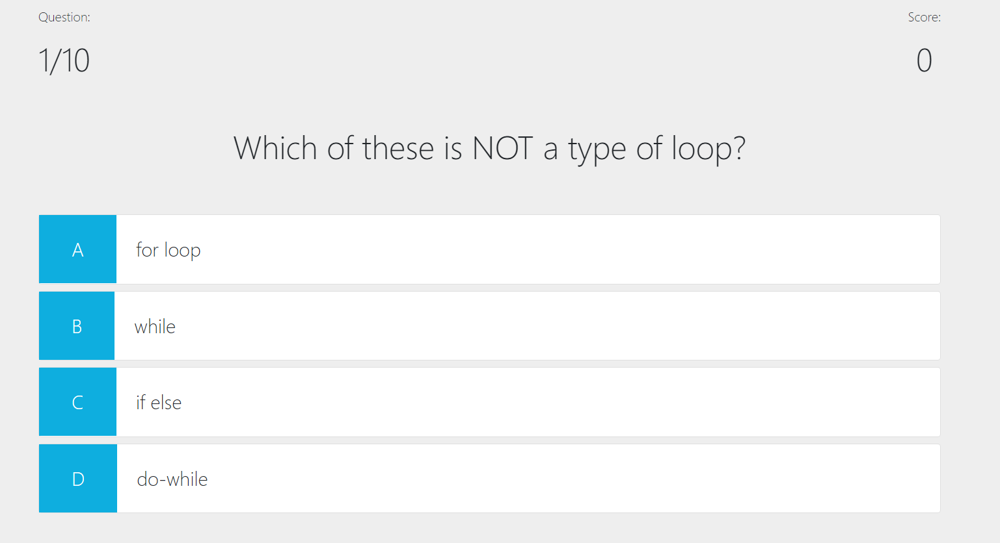

# zpl-javascript-code-quiz-1

## Goal
The main goal of this project was to create a JavaScript code quiz to gauge my progress with learning JavaScript compared to my peers.

## What I learned
In this project, I learned how to create arrays within arrays through coding the questions in this project.

## Link to live version
Check out my code quiz [here](https://zachary-levin.github.io/zpl-javascript-code-quiz-1/)

## Preview

## User Story
AS A coding boot camp student
I WANT to take a timed quiz on JavaScript fundamentals that stores high scores
SO THAT I can gauge my progress compared to my peers

## Acceptance Criteria
GIVEN I am taking a code quiz
WHEN I click the start button
THEN a timer starts and I am presented with a question
WHEN I answer a question
THEN I am presented with another question
WHEN I answer a question incorrectly
THEN time is subtracted from the clock
WHEN all questions are answered or the timer reaches 0
THEN the game is over
WHEN the game is over
THEN I can save my initials and score
